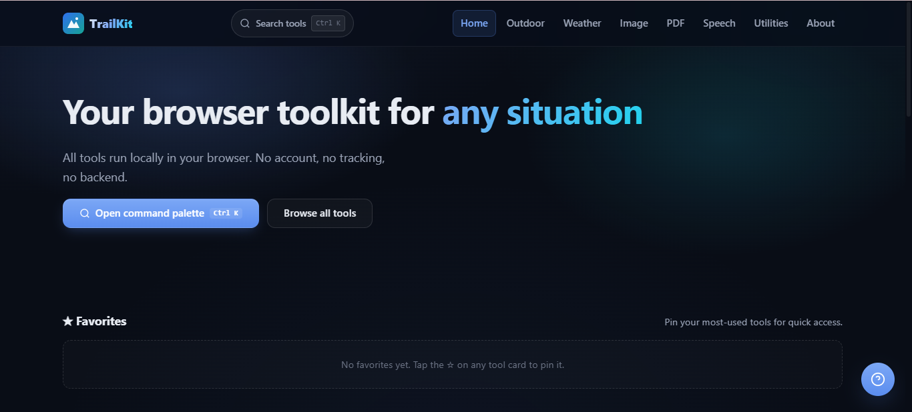

<div align="center">


# TrailKit

### Useful tools, wherever the trail takes you.

**A polished, offline-capable browser toolkit for outdoor navigation, weather, media, speech, development, and everyday utilities.**

<br>


<br>

[Overview](#overview) •
[Key Capabilities](#key-capabilities) •
[Quickstart](#quickstart) •
[Architecture](#architecture) •
[Configuration](#configuration) •
[Contributing](#contributing)

</div>

---

## Overview

TrailKit is a unified static web application for practical browser-native tools.

It follows a simple principle:

> **Do useful work locally whenever the browser can do it.**

TrailKit requires:

- No backend
- No account
- No build step
- No application database
- No analytics
- No unnecessary data collection

Local utilities execute directly in the browser whenever possible. Network-dependent features communicate directly with their documented public APIs.

The result is a lightweight field companion that can be deployed to static hosting, installed as a PWA, and used offline for many local workflows.

### Core Principles

- **Local-first** — process files and calculations directly in the browser.
- **Offline-capable** — cache the application shell for offline use.
- **Private by design** — no TrailKit backend for user files.
- **Static by default** — deploy anywhere that serves static files.
- **Accessible** — keyboard-friendly, semantic, responsive, and reduced-motion aware.
- **Performance-conscious** — browser-native APIs wherever practical.
- **Dark-only** — a deep-space interface with frosted surfaces and restrained motion.

---

## Key Capabilities

| Capability | Technical Specification | Benefit | Status |
| --- | --- | --- | --- |
| Outdoor tools | Browser calculations and geospatial formulas | Distance, bearing, sunrise, sunset, and altitude utilities | Stable |
| Weather | Open-Meteo APIs | Current conditions and multi-day forecasts | Stable |
| Image tools | Canvas API | Resize, compress, convert, rotate, and crop locally | Stable |
| PDF tools | jsPDF | Generate PDFs without uploading files | Stable |
| Speech | Web Speech API | Browser-native live transcription | Browser-dependent |
| Cryptography | Web Crypto + local MD5 | SHA-1/256/384/512 and compatibility hashing | Stable |
| File utilities | File API | Local file hashing and processing | Stable |
| Encoding | Browser APIs | Base64 and JSON processing | Stable |
| UUID | Browser/local generation | Generate UUID v4 values locally | Stable |
| QR codes | qrcode-generator | Generate QR codes locally | Stable |
| Currency | Frankfurter v2 | Public exchange-rate conversion | Network-dependent |
| Personalization | `localStorage` | Favorites and recent tools | Stable |
| Command palette | Keyboard-first search | Fast tool discovery and navigation | Stable |
| PWA | Manifest + Service Worker | Installable offline application shell | Stable |

---

## Visual Preview

<div align="center">



</div>

---

## Tools

### Outdoor

- Distance & bearing calculator
- Sunrise & sunset estimator
- Altitude estimator
- Manual atmospheric-pressure input

### Weather

- Location search
- Current conditions
- Seven-day forecast
- Temperature
- Precipitation
- Wind
- Humidity
- Sunrise
- Sunset
- Weather condition metadata

### Image

- Resize
- Compress
- Convert
- Rotate
- Crop

All image processing uses the browser Canvas API.

### PDF

- Images → PDF

PDF generation uses jsPDF.

### Speech

- Live transcription

Speech recognition uses the browser Web Speech API where supported.

### Utilities

- MD5
- SHA-1
- SHA-256
- SHA-384
- SHA-512
- File hashing
- UUID v4
- Base64
- JSON formatter
- JSON minifier
- Unit converter
- QR generator
- Currency converter

---

## Architecture

TrailKit keeps its runtime architecture intentionally simple.

```mermaid
flowchart LR
    A[User] --> B[TrailKit Web App]

    B --> C{Operation}

    C -->|Local| D[Browser APIs]
    C -->|Network| E[Public APIs]

    D --> D1[Canvas API]
    D --> D2[Web Crypto]
    D --> D3[File API]
    D --> D4[Web Speech API]
    D --> D5[localStorage]

    E --> E1[Open-Meteo]
    E --> E2[Frankfurter]

    D1 --> F[Result]
    D2 --> F
    D3 --> F
    D4 --> F
    D5 --> F
    E1 --> F
    E2 --> F

    B --> G[Service Worker]
    G --> H[Cached App Shell]
    H --> B
Runtime Model
text
Browser
│
├── Application shell
│   ├── HTML
│   ├── CSS
│   └── JavaScript
│
├── Local processing
│   ├── Canvas
│   ├── Web Crypto
│   ├── File API
│   ├── Web Speech
│   └── localStorage
│
├── External services
│   ├── Open-Meteo
│   └── Frankfurter
│
└── Service Worker
    └── Offline application shell
No TrailKit application server is required.

Quickstart
Requirements
TrailKit targets modern evergreen browsers.

Recommended baseline:

Chrome 90+

Edge 90+

Firefox 90+

Safari 15+

A local HTTP server is required for service-worker functionality.

Clone
bash
git clone https://github.com/nigore/trailkit.git
cd trailkit
Run with Python
bash
python -m http.server 8000
Run with Node.js
bash
npx serve .
Run with PHP
bash
php -S localhost:8000
Then open:

text
http://localhost:8000
Important: Do not open index.html directly using file://. Service workers require a valid HTTP(S) origin.

Project Structure
text
trailkit/
├── index.html
├── 404.html
├── offline.html
├── manifest.webmanifest
├── sw.js
├── README.md
├── CHANGELOG.md
├── LICENSE
│
├── assets/
│   ├── css/
│   │   ├── style.css
│   │   ├── responsive.css
│   │   ├── animations.css
│   │   └── mobile.css
│   │
│   ├── js/
│   │   ├── state.js
│   │   ├── notify.js
│   │   ├── tool-engine.js
│   │   ├── navigation.js
│   │   ├── favorites.js
│   │   ├── command-palette.js
│   │   ├── mobile.js
│   │   ├── help.js
│   │   ├── app.js
│   │   ├── outdoor.js
│   │   ├── weather.js
│   │   ├── image-tools.js
│   │   ├── pdf-tools.js
│   │   ├── speech.js
│   │   └── utilities.js
│   │
│   └── images/
│       ├── logo.svg
│       └── favicon.svg
│
└── pages/
    ├── outdoor.html
    ├── weather.html
    ├── image-tools.html
    ├── pdf-tools.html
    ├── speech.html
    ├── utilities.html
    └── about.html
Configuration
TrailKit does not require application-level environment variables or API keys for its documented public services.

Runtime behavior is controlled through browser APIs, local preferences, and static application configuration.

Option	Type	Default	Description
Theme	"dark"	"dark"	TrailKit uses a permanent dark interface.
Favorites	string[]	[]	Locally persisted favorite tool IDs.
Recent tools	string[]	[]	Locally persisted recently used tools.
Weather location	Location object	Browser / manual	Last selected weather location may be stored locally.
Motion	Media query	System preference	Follows prefers-reduced-motion.
Geolocation	Browser API	Permission required	Uses browser geolocation when granted.
Service-worker cache	string	trailkit-v2.0.0	Cache namespace used by sw.js.
Weather API	Open-Meteo	Public endpoint	No API key required.
Currency API	Frankfurter v2	Public endpoint	No API key required.
PDF engine	jsPDF 2.5.2	CDN dependency	Image-to-PDF generation.
QR engine	qrcode-generator 1.4.4	CDN dependency	QR generation.
Sensitive information must never be stored in localStorage.

Design System
TrailKit uses a custom CSS-variable-driven design system.

Concern	File
Primary styles	assets/css/style.css
Responsive styles	assets/css/responsive.css, assets/css/mobile.css
Motion styles	assets/css/animations.css
Visual Direction
The interface combines:

Deep-space backgrounds

Frosted-glass surfaces

Subtle gradients

Ambient lighting

Soft glows

High-contrast typography

Restrained corner radii

Responsive layouts

Purposeful micro-interactions

Performance-conscious animation

The goal is a premium outdoor-technology interface rather than a generic dashboard.

Color Tokens
Token	Value	Purpose
--bg-1	#070b14	Primary background
--bg-2	#0d1422	Secondary background
--surface	rgba(17, 25, 40, 0.72)	Glass surface
--surface-solid	#111928	Fallback surface
--primary	#6ea8ff	Primary brand accent
--primary-strong	#4f7cff	Strong interactive accent
--accent	#22d3b6	Secondary accent
--text	#f1f5fb	Primary text
--text-muted	#98a5b8	Secondary text
--border	rgba(255,255,255,.09)	Default border
--border-hover	rgba(110,168,255,.30)	Interactive border
Glass Surfaces
Preferred glass treatment:

css
background: rgba(17, 25, 40, 0.72);
border: 1px solid rgba(255, 255, 255, 0.08);
backdrop-filter: blur(20px) saturate(140%);
-webkit-backdrop-filter: blur(20px) saturate(140%);
Browsers without backdrop-filter support should receive a translucent or opaque fallback.

Typography
TrailKit uses two complementary typefaces.

Manrope
Primary UI typeface for:

Body text

Navigation

Buttons

Labels

Forms

Cards

Tables

Metadata

Tool interfaces

Recommended weights: 400, 500, 600, 700, 800.

Space Grotesk
Display typeface for:

Page titles

Hero text

Major headings

Dashboard headings

Weather temperatures

Large numerical displays

Recommended weights: 500, 600, 700.

Do not use Space Grotesk for every interface element.

Typography Tokens
css
:root {
  --font-ui:
    "Manrope",
    system-ui,
    -apple-system,
    BlinkMacSystemFont,
    "Segoe UI",
    sans-serif;

  --font-display:
    "Space Grotesk",
    "Manrope",
    system-ui,
    sans-serif;

  --weight-regular: 400;
  --weight-medium: 500;
  --weight-semibold: 600;
  --weight-bold: 700;
  --weight-extrabold: 800;

  --text-xs: 0.75rem;
  --text-sm: 0.875rem;
  --text-md: 1rem;
  --text-lg: 1.125rem;
  --text-xl: 1.375rem;
  --text-2xl: clamp(1.5rem, 3vw, 2rem);
  --text-3xl: clamp(2rem, 5vw, 3.5rem);
  --text-display: clamp(2.75rem, 8vw, 6rem);
}
Major typography should use clamp() to remain readable across mobile and desktop displays.

Motion
TrailKit uses shared easing tokens:

css
--ease-out: cubic-bezier(0.22, 1, 0.36, 1);
--ease-spring: cubic-bezier(0.34, 1.56, 0.64, 1);
--ease-in-out: cubic-bezier(0.65, 0, 0.35, 1);
Common animations:

Animation	Purpose
fadeInUp	Content entrance
float	Subtle floating elements
floatSlow	Atmospheric movement
forecastEnter	Weather card entrance
pulseDot	Speech / listening indicators
glowPulse	Ambient lighting
shimmer	Loading states
All non-essential animation must respect:

css
@media (prefers-reduced-motion: reduce)
Weather
The weather module provides:

Location search

Current conditions

Multi-day forecast

Temperature

Precipitation

Wind

Sunrise

Sunset

Humidity

Weather condition

Weather data is retrieved from Open-Meteo.

Weather Hierarchy
text
Location

29°

Partly Cloudy

Humidity     Wind       Precipitation
72%          14 km/h    20%
Space Grotesk is used for temperatures and major weather displays.

Manrope is used for supporting metadata.

Forecast Cards
Forecast cards may include:

Day

Date

Condition

Condition icon

High temperature

Low temperature

Precipitation

Wind

Sunrise

Sunset

The exact information depends on available API data.

Privacy
TrailKit follows a local-first privacy model.

Local Processing
Whenever possible, these operations remain entirely inside the browser:

Image processing

PDF generation

Hashing

Encoding

Conversion

UUID generation

JSON processing

TrailKit does not require a backend for these operations.

Analytics
TrailKit does not intentionally include:

Analytics

Tracking pixels

Advertising trackers

User accounts

Email collection

Speech
TrailKit does not intentionally store microphone recordings.

The browser vendor may process speech through external services depending on its Web Speech implementation.

Weather
Weather requests communicate directly with Open-Meteo.

Currency
Currency requests communicate directly with Frankfurter.

localStorage
TrailKit may store:

Favorites

Recent tools

Last weather location

Lightweight application preferences

Sensitive information should never be stored in localStorage.

Security
TrailKit follows a client-side security model intended to minimize unnecessary attack surface.

Application code should:

Avoid eval()

Avoid new Function()

Avoid dynamic script injection

Validate user input

Safely render user-generated content

Validate file types

Validate file sizes

Range-check coordinates

Validate numeric input

Validate API responses

Load external dependencies over HTTPS

Never expose private credentials

Avoid exposing raw stack traces

MD5
MD5 is cryptographically broken.

It must not be used for:

Password storage

Digital signatures

Security-sensitive integrity verification

Where provided, MD5 is a compatibility/checksum utility only.

Accessibility
TrailKit is designed around accessible interaction.

Requirements include:

Semantic HTML landmarks

Keyboard navigation

Visible :focus-visible states

Explicit form labels

Appropriate ARIA attributes

Accessible dialogs

Accessible buttons

Live status regions

Keyboard-friendly command palette

Touch-friendly controls

Reduced-motion support

Sufficient text contrast

Mobile controls should target approximately 48 × 48 px where practical.

Offline & PWA
TrailKit is designed as an installable Progressive Web App.

Core PWA files:

manifest.webmanifest

sw.js

offline.html

Manifest
The manifest should define:

Application name

Short name

Description

Icons

Theme color

Background color

Display mode

Start URL

Shortcuts where supported

Branding metadata

Application Pages
Application pages should include:

html
<link rel="icon" href="assets/images/favicon.svg">
<meta name="theme-color" content="#070b14">
<meta name="apple-mobile-web-app-title" content="TrailKit">
Primary logo:

text
assets/images/logo.svg
Service Worker
The intended navigation strategy is:

text
Navigation
    │
    ├── Network
    │
    ├── Cache
    │
    └── offline.html
Same-origin application assets should use an appropriate cache-first / refresh strategy.

External API responses should not be blindly cached.

Cache Version
Current cache version:

text
trailkit-v2.0.0
When application assets change, update the version in sw.js.

Example:

text
trailkit-v2.0.1
Old caches should be removed during service-worker activation.

Offline Capabilities
After the application shell has been cached, many local tools can continue working offline.

Network-dependent features include:

Weather

Currency conversion

External CDN resources not already cached

The interface should expose clear offline states when network operations cannot complete.

Deployment
TrailKit is a static web application.

No server-side runtime is required.

All resources should use deployment-safe relative paths so the application can run from:

Domain roots

GitHub Pages subpaths

Static hosting providers

GitHub Pages
Push the project to GitHub.

Open Settings → Pages.

Select the main branch.

Select the repository root.

Save.

The resulting URL typically follows:

text
https://<username>.github.io/<repository>/
Service-worker scope and relative asset paths must remain valid under repository subpaths.

Netlify
Build command: none

Publish directory: /

Vercel
Framework Preset: Other

Build Command: (empty)

Output Directory: .

Cloudflare Pages
Build Command: (empty)

Output Directory: /

External Dependencies
Dependency	Version	Purpose	License
jsPDF	2.5.2	PDF generation	MIT
qrcode-generator	1.4.4	QR generation	MIT
Dependencies may be loaded over HTTPS from public CDNs.

If an external dependency fails to load, the affected feature should display an appropriate error state without breaking unrelated tools.

APIs
API	Used By	Key Required	Notes
Open-Meteo Geocoding	Weather	No	Public API
Open-Meteo Forecast	Weather	No	Public API
Frankfurter v2	Currency	No	Public exchange-rate API
No API keys or private credentials are required for the documented APIs.

Never commit secrets to the repository.

Browser Support
TrailKit targets modern evergreen browsers.

Browser	Baseline
Chrome	90+
Edge	90+
Firefox	90+
Safari	15+
Web Speech API
Speech recognition support varies between browsers.

TrailKit should detect support at runtime and display a clear compatibility message when unavailable.

Web Crypto
SHA-family hashing requires Web Crypto API support.

MD5 is not available through Web Crypto and must never be treated as a secure cryptographic algorithm.

Geolocation
Geolocation requires:

User permission

A secure context — normally HTTPS

Backdrop Filter
Browsers without backdrop-filter support should receive a translucent or opaque fallback surface.

Known Limitations
Barometric Altitude
Standard browser APIs generally do not expose phone barometer hardware.

Altitude estimation therefore requires manual pressure input or another supported source.

Web Speech API
Speech recognition support varies between browsers.

Firefox does not provide the same recognition support available in Chromium-based browsers and Safari.

Browser Speech Processing
The browser vendor may process speech through external services.

Whisper
A browser-native Whisper implementation such as whisper.cpp requires WASM builds and model files that are not automatically bundled with TrailKit.

Reverse Geocoding
Location workflows may provide coordinates instead of a resolved city name when reverse geocoding is unavailable.

Service Workers
Service workers do not operate from file:// URLs.

External APIs
Weather and currency features require network connectivity.

Dark-Only Design
TrailKit intentionally uses a permanent dark interface.

A light theme is not currently provided.

Branding
Logo
Primary logo:

text
assets/images/logo.svg
Favicon:

text
assets/images/favicon.svg
The primary logo is:

Original

Vector-based

Scalable

Dark-background compatible

Suitable for favicon and PWA usage

Free of raster image dependencies

Free of Base64 image data

Free of JavaScript

Free of external CSS dependencies

Usage:

html

Typography
Manrope is the primary UI typeface.

Space Grotesk is the display typeface.

System fallbacks must always be provided.

Branding Integration
Branding should be consistent across:

Desktop header

Mobile header

Dashboard

404 page

Offline page

About page

Browser metadata

PWA manifest

Branding QA
Before release:

□ SVG logo exists
□ Logo path is correct
□ Logo loads on required pages
□ Logo works on dark backgrounds
□ Logo scales correctly
□ Favicon loads
□ PWA icon configuration is valid
□ Manrope loads correctly
□ Space Grotesk loads correctly
□ System font fallback works
□ No incorrect FOIT behavior
□ Only required font weights are loaded
□ Responsive typography works
□ Weather typography is correctly applied
□ No obsolete theme references remain
Search the project for obsolete references:

text
Arial
Helvetica
Times New Roman
Inter
Roboto
theme-toggle
light-theme
Remove obsolete references unless intentionally required by a third-party dependency.

Contributing
Contributions should preserve TrailKit's core principles:

Keep local work local whenever practical.

Avoid unnecessary runtime dependencies.

Preserve static-host compatibility.

Keep browser requirements explicit.

Maintain keyboard and mobile usability.

Respect prefers-reduced-motion.

Avoid unnecessary data collection.

Keep documentation synchronized with implementation.

Validate deployment under repository subpaths.

Never commit credentials or private configuration.

Pull Request Checklist
□ Local development works over HTTP
□ No broken relative paths
□ No console errors
□ Mobile layout verified
□ Keyboard navigation verified
□ Reduced-motion behavior verified
□ Offline shell verified
□ External API failures handled
□ New dependencies documented
□ README updated when required
□ CHANGELOG updated when required
Credits
TrailKit was inspired by concepts, capabilities, and implementation patterns found across open-source projects and public resources.

Project	Author	License
Trail Sense	Kyle Corry	MIT
AIC Weather Forecasting	fengyang95	MIT
Images-to-PDF	Swati4star	—
MultiMian ImageKit	Mianhassam96	—
whisper.cpp	ggml-org	MIT
Bash-Snippets	alexanderepstein	MIT
swap	florianv	MIT
WinScript	flick9000	—
Bootstrap	—	MIT (design reference)
Tailwind CSS	—	MIT (design reference)
Open-Meteo	—	Weather API
Frankfurter	—	Exchange-rate API
jsPDF	—	MIT
qrcode-generator	—	MIT
Third-party projects retain their respective licenses and trademarks.

TrailKit is not endorsed by or affiliated with these projects unless explicitly stated otherwise.

License
TrailKit is released under the MIT License.

See LICENSE for the complete license text.

Third-party projects and dependencies retain their respective licenses.

Changelog
v2.0.0
Breaking Changes
Removed the light/dark theme toggle.

TrailKit now uses a permanent dark-only visual system.

Removed obsolete theme-toggle documentation and references.

Updated the PWA cache version to trailkit-v2.0.0.

Added
New deep-space design system.

Frosted-glass visual language.

Animation and motion tokens.

Weather module documentation.

Multi-day weather-card documentation.

Custom TrailKit SVG logo.

Dedicated application icon assets.

Manrope UI typography.

Space Grotesk display typography.

Typography design tokens.

Responsive typography scaling.

Branding integration requirements.

Changed
Reworked documentation around the dark-only interface.

Updated project structure documentation.

Updated tool documentation.

Updated browser support documentation.

Updated privacy documentation.

Updated security documentation.

Updated accessibility documentation.

Updated offline / PWA documentation.

Updated known limitations documentation.

Updated navigation, cards, headings, buttons, and weather displays around the new typography system.

Fixed
Removed stale theme-toggle references.

Corrected malformed Markdown.

Corrected malformed code blocks.

Corrected project structure formatting.

Removed obsolete light-theme references.

Clarified service-worker cache versioning.

Standardized branding terminology.

Standardized typography documentation.

<div align="center">
Explore · Navigate · Create · Calculate · Discover

TrailKit — useful tools, wherever the trail takes you.


MIT License • Issues • Discussions • Repository

</div> ```
